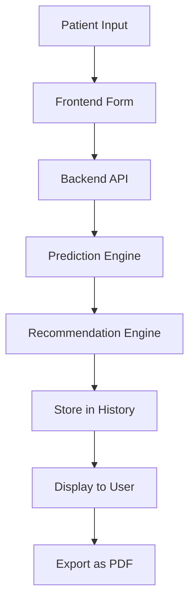
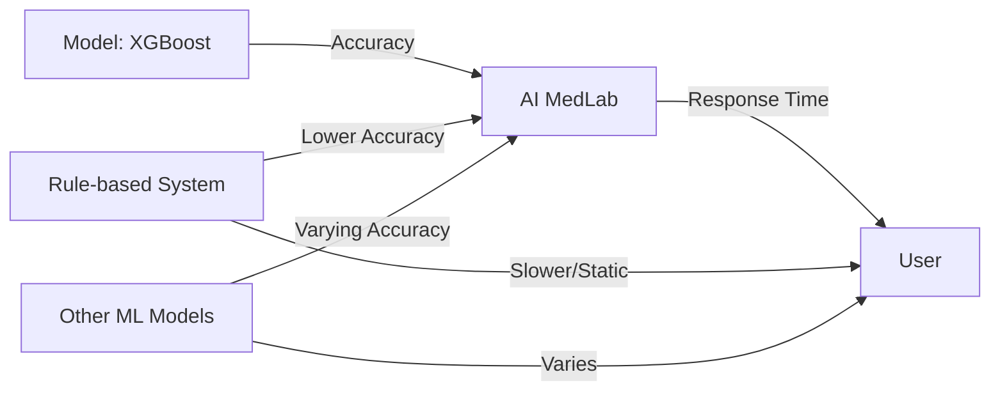

# AI MedLab Project Diagrams

## 1. System Architecture Diagram
```mermaid
flowchart TD
    A[User (Doctor/Nurse/Patient)] -->|Accesses| B[Frontend (HTML/CSS/JS)]
    B -->|AJAX/API Calls| C[Backend (Flask API)]
    C -->|Reads/Writes| D[Data Storage (JSON/CSV)]
    C -->|Predicts| E[ML Model (XGBoost)]
    E -->|Returns Prediction| C
    C -->|Sends Data| B
    B -->|Displays| A
```

## 2. Project Execution Workflow
```mermaid
flowchart TD
    A[Setup Environment] --> B[Start Backend (Flask)]
    B --> C[Open Frontend (dashboard.html)]
    C --> D[User Login/Action]
    D --> E[API Request to Backend]
    E --> F[Backend Processes Request]
    F --> G[Returns Response]
    G --> H[Frontend Updates UI]
```

## 3. Data Flow Diagram


## 4. Performance Comparison Diagram


---

## Key Terminal Commands for Code Implementation, Evaluation & Execution

### 1. Environment Setup
```powershell
# Create and activate virtual environment (Windows)
python -m venv venv
.\venv\Scripts\Activate.ps1

# Install dependencies
pip install -r requirement.txt
```

### 2. Running the Backend
```powershell
cd Backend
python app.py
```

### 3. Running Automated Tests
```powershell
# From the Backend directory
python test_api.py
python test_model_predictions.py
python test_prediction.py
```

### 4. Model Training & Evaluation
```powershell
cd model
python train_model.py
python test_current_model.py
```

### 5. Frontend
- Open `frontend/dashboard.html` in your web browser.

---

You can copy these commands into your PPT slides under the relevant sections for easy reference.
